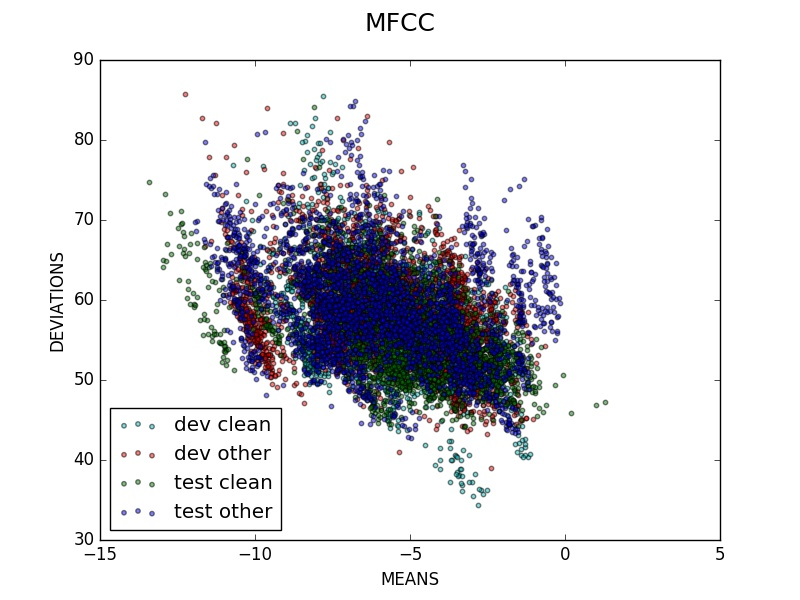
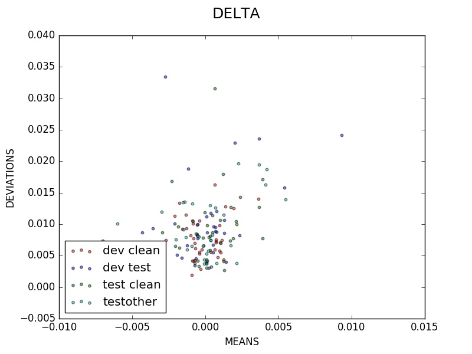

# Deep Speech
### September 12, 2016

## Experimentation

### Objectives

* [x] Analyze the Corpus

###  LibriSpeech ASR Corpus

#### General Observations

* Recordings are in studio conditions
* Clips are relatively short
* Clips contain single speaker data
* Speaker identification data is included
* Text to speech annotation is included

#### Preprocessing Parameters

* MFCC size: 50
* Hop Length: 700

#### Dev Clean

* Total Number of Samples: 2703
* Maximum Length along Time Axis: 1029

| | Mean | Deviation | Maximum | Minimum |
|:-:|:-:|:-:|:-:|:-:|
| MFCC | -5.50906989828 | 1.67165303697 | -2.12469975583 | -8.86310434637 |
| DELTA | -9.6719576219e-05 | 0.00119681878772 | 0.00361292595683 | -0.00271856227165 |

Datapoints were derived one per speaker per sample.

#### Dev Other

* Total Number of Samples: 2864
* Maximum Length along Time Axis: 1108

| | Mean | Deviation | Maximum | Minimum |
|:-:|:-:|:-:|:-:|:-:|
| MFCC | -5.80414144886 | 2.02013711785 | -2.81372274035 | -9.97661684884 |
| DELTA |0.000313083615503 | 0.00245069128579 | 0.00929797544083 | -0.00430383842016 |

Datapoints were derived one per speaker per sample.

#### Test Clean

* Total Number of Samples: 2620
* Maximum Length along Time Axis: 1102

| | Mean | Deviation | Maximum | Minimum |
|:-:|:-:|:-:|:-:|:-:|
| MFCC | -5.31175425343 | 2.17003262699 | -1.13538039067 | -11.685041445 |
| DELTA | 0.000193841448925 | 0.00200898896513 | 0.00392949123812 | -0.00700810652843 |

Datapoints were derived one per speaker per sample.

#### Test Other

* Total Number of Samples: 2939
* Maximum Length along Time Axis: 1088

| | Mean | Deviation | Maximum | Minimum |
|:-:|:-:|:-:|:-:|:-:|
| MFCC | -5.9892141458 | 2.35737169603 | -0.766550495091 | -10.5714905135 |
| DELTA | 0.00011431422759 | 0.00223703720655 | 0.00547874631181 | -0.00601587172713 |

Datapoints were derived one per speaker per sample.

#### Scatter Plots

