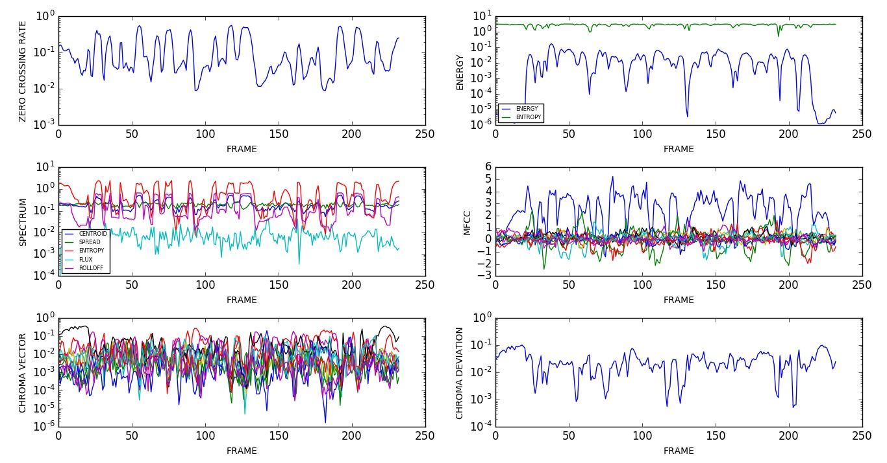
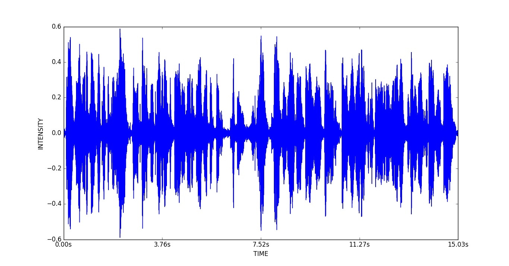
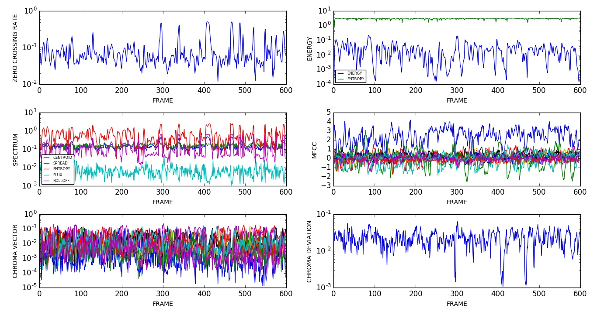

# Deep Speech
### October 3, 2016

## Experimentation

### Objectives

* [x] Analyze an Audio Sample

### Libre Speech Sample

* Duration: ~6s
* Number of Speakers: 1
* Speaker Overlap: no
* File: ../data/LibreSpeech/dev-clean/1272/128104/1272-128104-0000.flac
* Section: whole

#### Plots

### Speakers in the Wild Sample

* Duration: ~15s
* Number of Speakers: 2
* Speaker Overlap: no
* File: ../data/SpeakersInTheWild/dev/audio/abcsp.flac
* Section: starts at 37s

#### Plots

