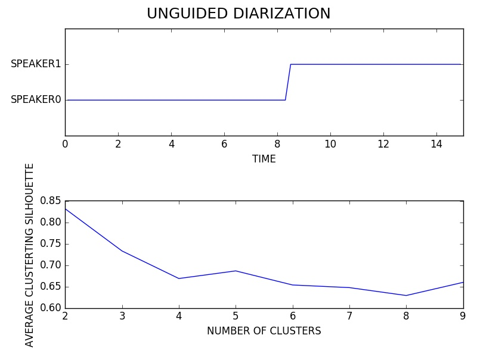

# Deep Speech
### October 10, 2016

## Experimentation

### Objectives

* [x] Diarize an Audio Sample

### Speakers in the Wild 15s Sample

* Duration: ~15s
* Number of Speakers: 2
* Speaker Overlap: no
* File: ../data/SpeakersInTheWild/dev/audio/abcsp.flac
* Section: starts at 37s
* Manual Diarization:
	* Speaker1: [0s, 6s]
	* Speaker2: [7s, 15s]

#### Plots

### Speakers in the Wild 15s Sample

* Duration: ~60s
* Number of Speakers: 2
* Speaker Overlap: yes
* File: ../data/SpeakersInTheWild/dev/audio/abcsp.flac
* Section: whole
* Manual Diarization:
	* Speaker1: [0, 14], [22, 23], [24, 27], [31, 43] 
	* Speaker2: [14, 17], [19, 22], [44, 60]
	* Overlaps: [17, 19], [23, 24], [27, 31]

#### Plots

