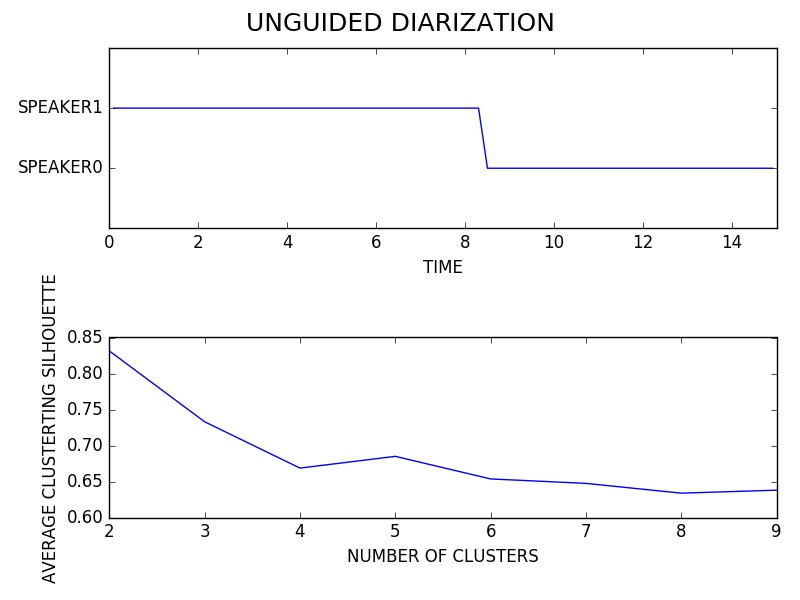
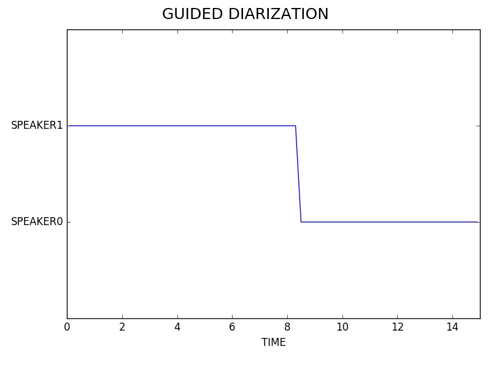
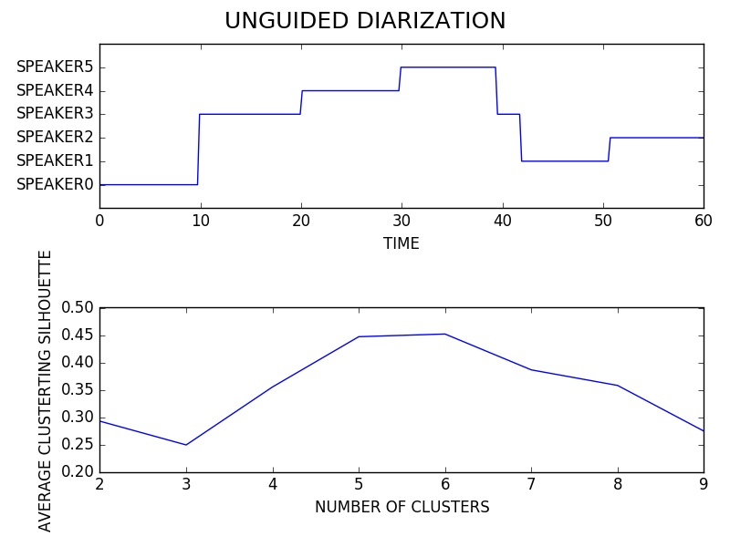
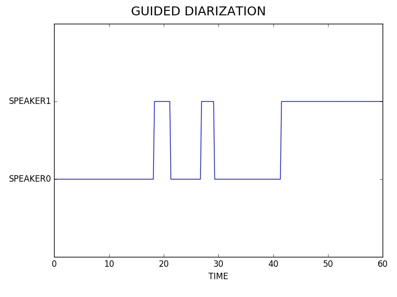

# Deep Speech
### October 10, 2016

## Experimentation

### Objectives

* [x] Diarize an Audio Sample

### Speakers in the Wild 15s Sample

* Duration: ~15s
* Number of Speakers: 2
* Speaker Overlap: no
* File: ../data/SpeakersInTheWild/dev/audio/abcsp.flac
* Section: starts at 37s
* Manual Diarization:
	* Speaker1: [0s, 6s]
	* Speaker2: [7s, 15s]

#### Plots

### Speakers in the Wild 60s Sample

* Duration: ~60s
* Number of Speakers: 2
* Speaker Overlap: yes
* File: ../data/SpeakersInTheWild/dev/audio/abcsp.flac
* Section: starts at 0s
* Manual Diarization:
	* Speaker1: [0s, 14s], [22s, 23s], [24s, 27s], [31s, 43s]
	* Speaker2: [14s, 17s], [19s, 22s], [44s, 60s]
	* Overlaps: [17s, 19s], [23s, 24s], [27s, 31s]

#### Plots

